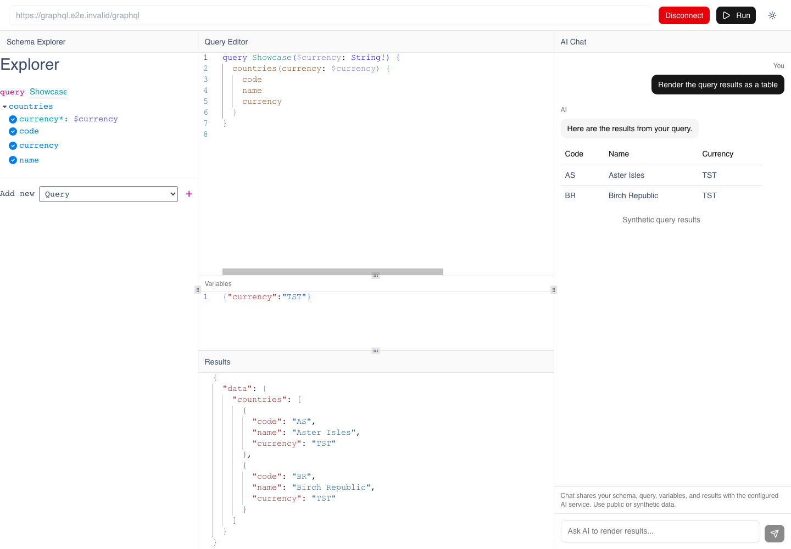

# AI Render

AI Render is a local tool for exploring public GraphQL APIs. Browse a schema
and run a read-only query, then optionally ask AI to show the results as an
interactive table, chart, or card.



AI Render is a **code-only project for local development and experiments**.
It supports **read-only queries to public HTTP(S) GraphQL endpoints**. Mutations,
subscriptions, private-network endpoints, redirects and arbitrary authentication
headers are deliberately disabled. The local API is unauthenticated; keep it on
loopback. There are no deployment scripts or workflows.

## What this project adds

The integration joins GraphiQL's schema explorer and Monaco editor with Tambo's
component registry. A shared bridge keeps the query, variables, schema summary and
results in sync, including queries initiated by the AI tools. The component wrappers
validate props with Zod; the AI chooses from 48 registered shadcn/ui components.

GraphiQL, Monaco, Tambo and shadcn/ui are upstream projects. AI Render supplies the
workbench composition, context/tool integration, wrappers and constrained GraphQL
proxy. See [THIRD_PARTY_NOTICES.md](THIRD_PARTY_NOTICES.md) for attribution.

## Run locally

Requirements: **Node.js 22.12+**, **pnpm 10.18.2**. CI uses Node 22.

```sh
git clone https://github.com/flinstonedev/ai-render.git
cd ai-render
pnpm install --frozen-lockfile
cp .env.example .env.local
pnpm dev
```

Open http://127.0.0.1:3000. Both local run commands bind to loopback. Worker assets
are generated automatically before development/build; no font download or paid
service is required to run the GraphQL workbench.

To run the optimized build locally:

```sh
pnpm build
pnpm start
```

The optional AI panel remains disabled when `NEXT_PUBLIC_TAMBO_API_KEY` is blank.
To enable it, supply a Tambo-supported browser/project key and optionally
`NEXT_PUBLIC_TAMBO_URL`. These values are public in the browser bundle; do not use
a secret server credential. Restart/rebuild after changing public environment
variables. The provider may charge for AI usage: configure restrictions and budgets.

## Try a query

Use the public example endpoint `https://countries.trevorblades.com/graphql`, then
click **Connect**. Its availability and data are controlled by its operator.

Enter this in the query editor and click **Run**:

```graphql
query Countries {
  countries(filter: { code: { in: ["DE", "FR"] } }) {
    code
    name
    capital
  }
}
```

If AI is configured, ask **“Show these countries as a table.”** The chat can use
`execute_graphql_query` to fetch further read-only data or `get_schema_info` to
inspect the schema. Endpoint descriptions and returned data are untrusted input;
use public/synthetic data and review AI-selected results.

## Data flow and privacy

```text
Browser: schema explorer + editor + result viewer
     │ endpoint, query, variables
     ▼
Next.js GraphQL proxy ── validated/pinned connection ──► public GraphQL API
     │ bounded JSON result
     ▼
Shared in-memory bridge ── on chat submission ──► Tambo / configured AI provider
     ▲                                             │
     └──────── selected component + tool calls ─────┘
```

The Next.js proxy handles bounded data in memory and does not intentionally log
or persist it. GraphiQL localStorage persistence is disabled; reloading clears
local query/result state. A theme preference may persist. AI context includes the
endpoint, schema, query, variables and a result excerpt (currently up to 4,000
characters). AI tools can send additional query results to the service.

An ephemeral random conversation key replaces the previous shared default key.
It is a grouping identifier, not authentication. Provider-side retention is
separate from local state; disconnecting does not delete provider conversations.
Read [SECURITY.md](SECURITY.md) before entering anything sensitive.

## Proxy limits

- Public IPs only, including every DNS A/AAAA answer; mixed public/private answers
  are rejected. The connection is pinned to a validated IP with the original TLS
  server name and certificate verification. All redirects are rejected.
- Request body: **256 KiB**; query: **64 KiB / 10,000 parsed tokens**;
  uncompressed GraphQL JSON response: **2 MiB**; response headers: **16 KiB**.
- **15 seconds** overall and **8 concurrent requests per server process**.
  This is not a distributed rate limit or an upstream cost estimate.
- Read-only queries only. Incoming authorization/cookies/custom headers are not
  forwarded; responses are uncached. A public API can still implement expensive
  or side-effecting resolvers, so narrow queries and use pagination.

To constrain the endpoints used locally, set an exact URL allowlist:

```env
GRAPHQL_ALLOWED_ENDPOINTS=https://countries.trevorblades.com/graphql
```

Comma-separated URLs are supported. No wildcards: scheme, host, port, path and
query string must match. Blank allows arbitrary public endpoints with all the
same network protections. The allowlist never permits private addresses.

Local loopback operation is the supported workflow. The repository includes
validation and security CI; these workflows do not deploy the application.

## Validation

```sh
pnpm lint
pnpm typecheck
pnpm test
pnpm build
pnpm exec playwright install chromium
pnpm test:e2e
pnpm audit
```

`pnpm check` runs lint, typecheck, unit tests and build. CI also runs Chromium e2e
tests. Unit tests exercise URL/IP/DNS and pinned-transport policy, redirects,
stream bounds, cancellation, input validation, concurrency and context/tool logic.
Browser tests use a real synthetic GraphQL schema and a deterministic mocked Tambo
stream, then verify the actual rendered table and error recovery. They reject
unexpected outbound HTTP and require no paid account or credentials. They do not
validate live AI quality or provider security. See [e2e/README.md](e2e/README.md).

The screenshot above is generated from those synthetic fixtures:

```sh
UPDATE_DEMO_SCREENSHOT=1 pnpm test:e2e --grep 'connects,'
```

## Code map

- `src/components/graphql/`: schema/editor/result views and the shared bridge.
- `src/components/tambo/`: AI context, tools, registry and component wrappers.
- `src/lib/graphql/`: input validation, DNS/IP policy and bounded outbound transport.
- `src/app/api/graphql/`: query and introspection route handlers.
- `scripts/build-workers.mjs`: builds locally served editor workers from the lockfile.
- `e2e/`: deterministic complete-flow browser tests.

## License and contributions

Original AI Render code is [MIT licensed](LICENSE). Third-party components,
workers and dependencies retain their upstream licenses and notices; this does
not relicense those projects or external GraphQL datasets. See
[CONTRIBUTING.md](CONTRIBUTING.md) and [SECURITY.md](SECURITY.md).
